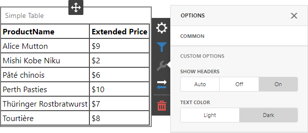
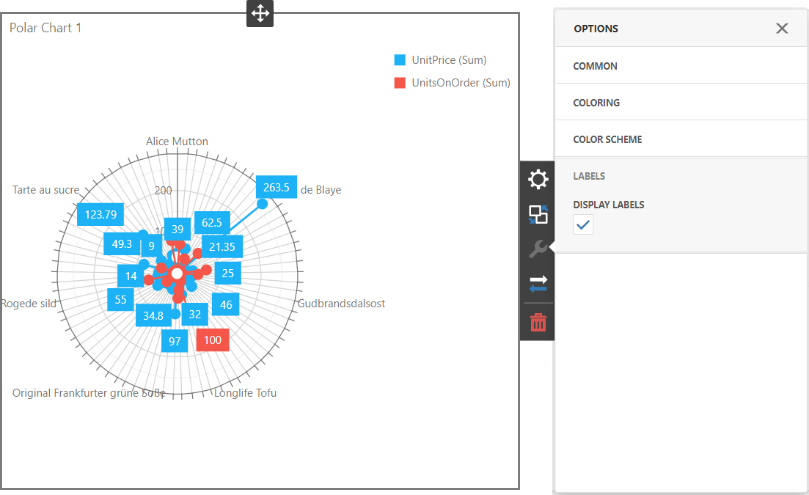
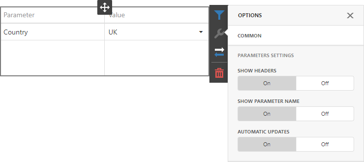
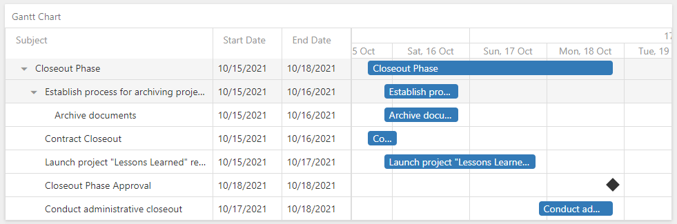

# Dashboard for ASP.NET Core - Custom Item Gallery

The example contains the source code of custom items you can use in your Web Dashboard application.

<!-- default file list -->

## Files to Look At

* [SimpleTableItem.js](CS/AspNetCoreCustomItem/wwwroot/js/SimpleTableItem.js)
* [PolarChartItem.js](CS/AspNetCoreCustomItem/wwwroot/js/PolarChartItem.js)
* [ParameterItem.js](CS/AspNetCoreCustomItem/wwwroot/js/ParameterItem.js)
* [OnlineMapItem.js](CS/AspNetCoreCustomItem/wwwroot/js/OnlineMapItem.js)
* [WebPageItem.js](CS/AspNetCoreCustomItem/wwwroot/js/WebPageItem.js)
* [GanttItem.js](CS/AspNetCoreCustomItem/wwwroot/js/GanttItem.js)
* [_Layout.cshtml](CS/AspNetCoreCustomItem/Pages/_Layout.cshtml)

<!-- default file list end -->

## Country Sales Dashboard

The dashboard displays product sales for the selected category. The Country parameter filters data by a country.

This dashboard contains the following custom items:

### Simple Table

**View Script**: [SimpleTableItem.js](CS/AspNetCoreCustomItem/wwwroot/js/SimpleTableItem.js)

A custom **Simple Table** item renders data from the measure / dimensions as an HTML table. You can use the Simple Table as a detail item along with the Master-Filtering feature. This custom item supports the following setting that you can configure in the Web Dashboard UI:

- **Show Headers** - Specifies whether to show the field headers in the table. The default value is Auto.

### Polar Chart Item

**View Script**: [PolarChartItem.js](CS/AspNetCoreCustomItem/wwwroot/js/PolarChartItem.js)

A custom **Polar Chart** item that allows you to use the [dxPolarChart](https://js.devexpress.com/Documentation/ApiReference/UI_Components/dxPolarChart/) DevExtreme widget in your dashboards. This item supports the following settings that you can configure in the Web Dashboard UI:

- **Display Labels** - Specifies whether to show point labels.

### Parameter Item

**View Script**: [ParameterItem.js](CS/AspNetCoreCustomItem/wwwroot/js/ParameterItem.js)

A custom **Parameter** item renders [dashboard parameter dialog](https://docs.devexpress.com/Dashboard/117571) content inside the dashboard layout and allows you to edit and submit parameter values. This item supports the following settings that you can configure in the Web Dashboard UI:

- **Show Headers** - Specifies whether to show headers in the parameters table.
- **Show Parameter Name** - Specifies whether to show the first column with parameter names.
- **Automatic Updates** - Specifies whether a parameter item is updated automatically. When enabled, this option hides the 'Submit' and 'Reset' buttons.

## Country Info Dashboard

The dashboard displays information from Wikipedia for the selected country.

This dashboard contains the following custom items:

### Online Map

**View Script**: [OnlineMapItem.js](CS/AspNetCoreCustomItem/wwwroot/js/OnlineMapItem.js)

A custom **Online Map** item allows you to place callouts on Google or Bing maps using geographical coordinates. The [dxMap](https://js.devexpress.com/Documentation/ApiReference/UI_Components/dxMap/) is used as an underlying widget. This custom item supports the following settings that you can configure in the Web Dashboard UI:

- **Provider** - Specifies whether to show Google or Bing maps.
- **Type** - Specifies the map type. You can choose between RoadMap, Satellite or Hybrid.
- **Display Mode** - Specifies whether to show markers or routes.

### Web Page

**View Script**: [WebPageItem.js](CS/AspNetCoreCustomItem/wwwroot/js/WebPageItem.js)

A custom **Web Page** item displays a single web page or a set of pages. You can use the Web Page as a detail item along with the Master-Filtering feature. This custom item supports the following setting that you can configure in the Web Dashboard UI:

- **URL** - Specifies a web page URL. You can set a single page as well as a set of pages (e.g., https://en.wikipedia.org/wiki/{0}). If you add a dimension and specify a placeholder, the data source field returns strings that will be inserted in the position of the {0} placeholder. Thus, the Web Page item joins the specified URL with the current dimension value and displays the page located by this address.

## Tasks Dashboard

The dashboard displays tasks. Select the task to display detailed information in the Grid.

This dashboard contains the following custom item:

### Gannt Item

**View Script**: [GanttItem.js](CS/AspNetCoreCustomItem/wwwroot/js/GanttItem.js)

A custom **Gannt** item displays the task flow and dependencies between tasks. This item uses [dxGantt](https://js.devexpress.com/Documentation/ApiReference/UI_Components/dxGantt/) as an underlying widget.

## License
These extensions are distributed under the **MIT** license (free and open-source), but can only be used with a commercial DevExpress Dashboard software product. You can [review the license terms](https://www.devexpress.com/Support/EULAs/NetComponents.xml) or [download a free trial version](https://go.devexpress.com/DevExpressDownload_UniversalTrial.aspx) of the Dashboard suite at [DevExpress.com](https://www.devexpress.com).

## Documentation

- [Create a Custom Item](https://docs.devexpress.com/Dashboard/117546/web-dashboard/ui-elements-and-customization/create-a-custom-item)
- [Install DevExpress Controls Using NuGet Packages](https://docs.devexpress.com/GeneralInformation/115912/installation/install-devexpress-controls-using-nuget-packages)

## More Examples

- [Dashboard for ASP.NET Core - Custom Item Tutorials](https://github.com/DevExpress-Examples/asp-net-core-dashboard-custom-item-tutorials)
- [Dashboard for React - Custom Item Tutorials](https://github.com/DevExpress-Examples/dashboard-react-app-custom-item-tutorials)
- [Dashboard for React - Custom Item Gallery](https://github.com/DevExpress-Examples/dashboard-for-react-custom-item-gallery)
